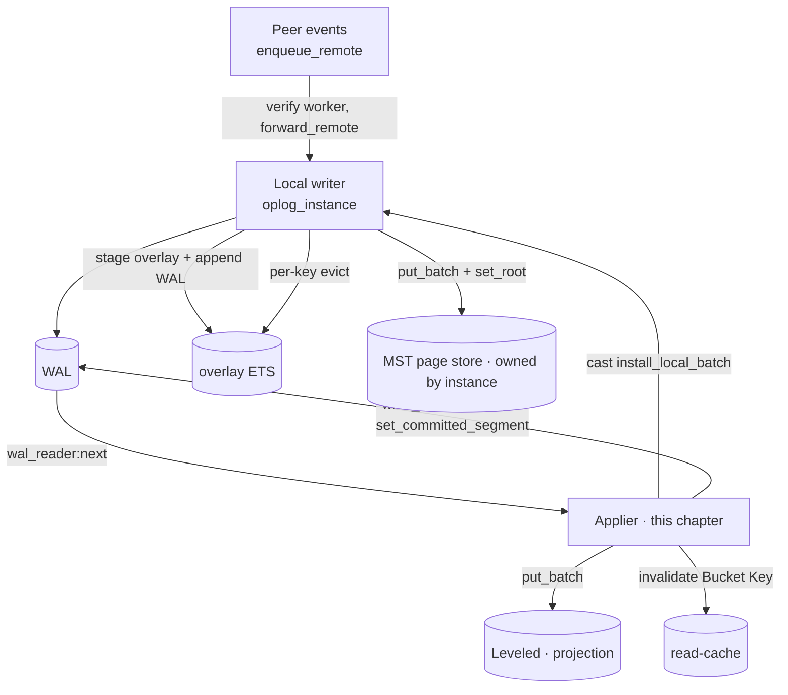
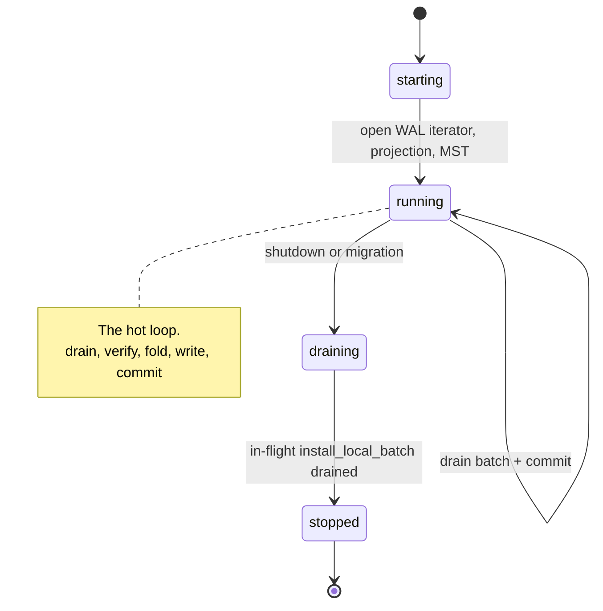
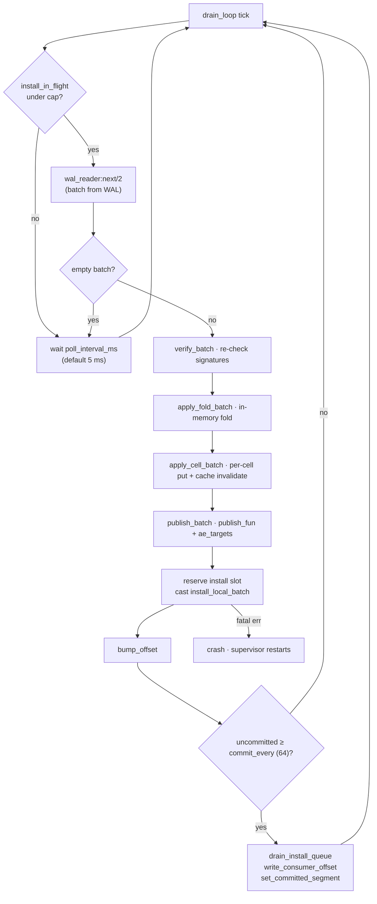
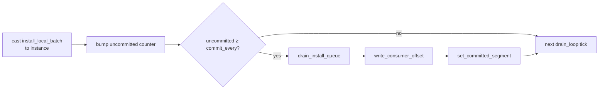
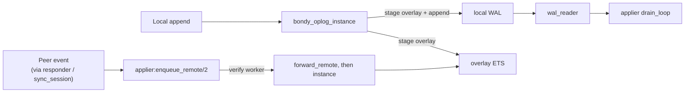
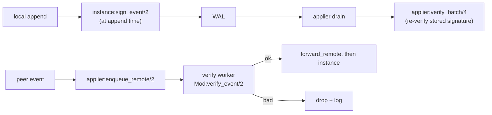
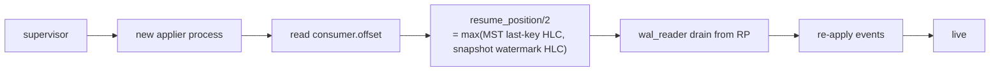
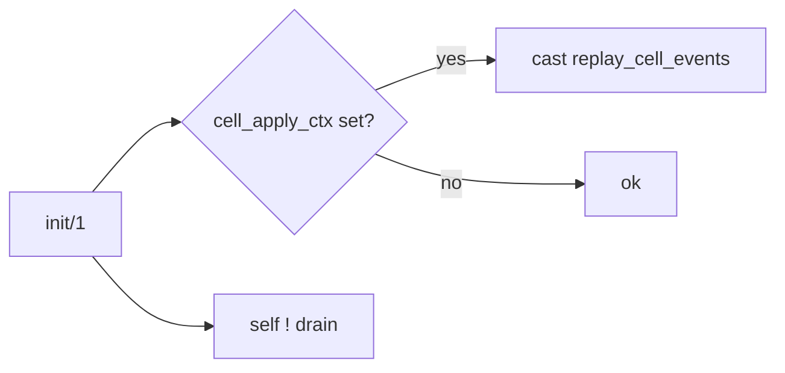

# The applier: the reconciler at the centre

> Audience: anyone debugging why a write isn't visible, or extending
> the substrate.
> Time to read: ~15 min.

If chapters [01](01_bondy_oplog.md) / [02](02_bondy_mst.md) /
[03](03_bondy_db.md) are the three packages, this chapter is the
**reconciler** that ties them together. The applier is one gen_server
per instance, supervised under `bondy_oplog_instance_sup` alongside
the instance, the WAL writer, and the WAL scrubber.

It owns four jobs:

1. Drain events from the WAL (via `bondy_oplog_wal_reader`).
2. Re-verify their signatures (defence-in-depth against WAL
   tampering — locals were signed at append time in the instance).
3. Fold each event into the projection (`apply_one_cell/9`) and
   ask the instance to install the corresponding MST pages
   (`install_local_batch`).
4. Persist the consumer offset and advance the WAL committed
   segment, so retention can sweep older segments.

Peer-received events take a separate door: `enqueue_remote/2` →
verify in a worker process → `forward_remote/2` to the instance.
They never go through the WAL on the receiving side.

## Where it sits



The applier is **the only process that writes the projection** (via
the registered `projection_adapter`). The MST page store is written
by the **instance** gen_server, not the applier — the applier sends
batches via `cast(install_local_batch)` and the instance does the
page put + root set under its own serial lock.

## The state machine



## The hot loop

The applier loop (`drain_loop/1` in `bondy_oplog_applier.erl`) is:



Two things to note:

- **`install_in_flight` is a counter atomic** that bounds how many
  install batches the applier may have outstanding at the instance.
  When the cap is full the loop simply waits — that is the actual
  back-pressure mechanism between applier and instance.
- **`maybe_commit` is event-count-driven**, not time-driven. After
  every `commit_every` events (default 64) the applier drains its
  install queue, persists the consumer offset, and advances the
  WAL's committed-segment marker so retention can sweep older
  segments.

## What "apply a batch" actually does

For each event in the batch:

```mermaid
sequenceDiagram
    autonumber
    participant Loop as applier loop
    participant Val as validator
    participant Fold as fold_module
    participant Adapter as projection_adapter
    participant Cache as cache_adapter

    Loop->>Val: verify_event(Event)
    Note over Loop,Val: Stored signature re-checked<br/>(defence vs WAL tampering)
    alt invalid signature
        Val-->>Loop: drop + log + skip
    else ok
        Loop->>Adapter: get(Handle, Bucket, Key)
        Adapter-->>Loop: prior cell frame (or not_found)
        Loop->>Fold: decode_state · apply_event · hlc · encode_state
        Fold-->>Loop: NewState, NewHlc
        Loop->>Adapter: put_batch([{Bucket, Key, NewFrame}])
        Loop->>Cache: delete(Handle, Bucket, Key)
    end
```

`apply_one_cell/9` issues **one `put_batch` per event** today, not an
accumulated batch put. The applier also keeps an in-memory
`fold_state` (`apply_fold_batch`) for namespaces that don't have a
projection at all; the per-cell projection path is the common case.

After the whole WAL batch has been folded:



The **commit point** is the consumer-offset write + the committed
segment advance. Crash before that → events are re-read from the WAL
on restart and re-applied; fold idempotency absorbs duplicates.

## Atomicity, in a paragraph

These steps are not transactional across stores. The ordering is
chosen so that:

- Crash **before `write_consumer_offset`** → on restart, the WAL
  reader resumes at the persisted offset; up to `commit_every`
  events (default 64) get re-read and re-applied. Idempotency
  absorbs them.
- Crash **after offset write, before `set_committed_segment`** →
  same effect on restart; the segment-advance only gates WAL
  retention, not correctness.
- Per-cell `put_batch` writes go to Leveled with
  `sync_strategy = strict` (see the projection_adapter init); each
  cell is fsynced before the cache invalidate.

Idempotency in the fold is the linchpin. Without it, no crash path
is safe.

## Two kinds of input: WAL and peer events

The applier receives events from two sources:



The crucial property: **peer-received events do not flow through the
local WAL**. The peer's WAL already has them durable. The applier
verifies their signature in a short-lived worker and then forwards
them to the instance, which stages them in the overlay just like a
local append.

Today's substrate has no eager-push fast-path; peer events arrive
through anti-entropy (`bondy_oplog_sync_session`) and through the
responder's request handlers. The staging hook (the `eager_pushed`
origin tag) exists in the overlay code as a forward-looking
mechanism but is not exercised.

## Overlay eviction

The overlay is evicted **per-event by the instance** as events are
installed (`evict_overlay_batch/2` in `bondy_oplog_instance.erl`),
using `ets:delete(Tab, Key)`. The applier's own eviction
(`evict_rejected_overlay/2`) only touches events the verifier
rejected — never the bulk apply path.

The overlay key shape `{{Bucket, Key}, EventHlc, EventKey}` makes
this safe under concurrent inserts: each row is identified by its
full event key, so deletes are point operations. There is no
watermark-based bulk eviction in the live code; the
`evict_to/3` helper in `bondy_oplog_db_overlay.erl` exists but has
no callers in `src/`.

## Validator gateway

Two paths, two checkpoints:



Local events are signed at the instance on the append path;
the applier re-verifies them when it reads them out of the WAL — a
defence-in-depth check against WAL-on-disk tampering. Peer events
are verified exactly once, in the `enqueue_remote` worker, before
being forwarded to the instance.

The validator snapshot is captured at applier init; an
operator-triggered `{refresh_validator, _}` cast swaps it.

## Crash recovery

If the applier crashes:



The consumer offset is the **durability fence** for WAL retention —
it tells the WAL writer how far the applier has committed, so older
segments are eligible for unlinking. The applier's actual resume
position is `resume_position/2`: the higher of (MST high-key HLC,
snapshot watermark HLC). On restart the worst case is `commit_every`
events of re-application (default 64). Idempotency absorbs them.

If the **writer** crashes too, the WAL recovery ([chapter 01](01_bondy_oplog.md)) runs
first inside the WAL writer's `init/1`: tail-truncate to the last
valid frame. The applier then resumes against the truncated tail.

## Cold-replay catch-up

On a fresh start (after a clean shutdown), the MST may still hold
peer-authored events whose `replay_cell_events` never ran — the WAL
drain only handles events past `resume_position/2`. The applier's
`init/1` triggers a one-shot replay of those cell events guarded by
the presence of a `cell_apply_ctx`:



This fixes the otherwise-subtle case where a node restart leaves the
projection stale until the next sync tick.

## Things to keep in mind

- **The applier owns the per-cell projection write.** The MST page
  store is written by the **instance**; the applier `cast`s
  install batches and the instance serialises them under its own
  lock.
- **Idempotency in the fold is non-negotiable.** Every crash path
  relies on it.
- **The consumer offset + committed segment are the commit point.**
  Everything before is recoverable; everything after is durable.
- **Peer events do not flow through the local WAL.** They are
  verified in `enqueue_remote` and forwarded to the instance for
  overlay staging + MST install.
- **Back-pressure is `install_in_flight`.** A bounded counter
  atomic gates the applier→instance hand-off; overlay-side limits
  (`max_overlay_events`, `max_overlay_bytes`) translate writer
  pressure into `{error, backpressure}` from the instance.

The tunables that matter today (`bondy_oplog_applier.erl:251-265`):

| Opt | Default | Purpose |
|---|---|---|
| `commit_every` | 64 | events between `write_consumer_offset` + `set_committed_segment` |
| `poll_interval_ms` | 5 | sleep when WAL is empty / install slot full |
| `cell_apply_target` | (registry-resolved) | which (projection, cache, fold_module, overlay) handle to write |
| `publish_fun`, `publish_ns` | undefined | per-cell publish hook |
| `ae_targets` | [] | freshness counters to bump per applied event |

## Pointers

Implementation:

- `bondy_oplog_applier.erl` — gen_server; `drain_loop/1`,
  `apply_fold_batch/3`, `apply_cell_batch/2`, `apply_one_cell/9`,
  `maybe_commit/1`, `enqueue_remote/2`, `forward_remote/2`,
  `verify_batch/4`, `resume_position/2`, `invalidate_cache/4`.
- `bondy_oplog_instance.erl` — `install_local_batch` handler,
  `evict_overlay_batch/2`, `sign_event/2`, `backpressure_admit/2`.
- `bondy_oplog_wal_reader.erl` — the WAL drain cursor.
- `bondy_oplog_wal.erl` — `write_consumer_offset/2`,
  `set_committed_segment/2`.
- `bondy_oplog_db_overlay.erl` — overlay key shape and per-row
  delete.
- `bondy_oplog_validator.erl` (+ `_crypto` / `_trust` variants) —
  verifier callbacks.
- `bondy_oplog_instance_sup.erl` — the supervisor wiring (instance,
  WAL writer, applier, WAL scrubber as children).

Background: see [chapter 06](06_compaction_and_bootstrap.md) for how
the applier's writes feed compaction.
