# Fold strategies: pluggable CRDT merge

> Audience: anyone declaring a new namespace, or curious why one
> substrate can serve LWW, OR-Set, presence, and strict-uniqueness
> all at once.
> Time to read: ~15 min.

`bondy_mst` is **fold-agnostic**. The substrate appends events,
replicates them, applies them — but it does not know what an event
*means*. The meaning lives in a per-namespace **fold module** that
implements the `bondy_oplog_fold` behaviour.

A fold module is — at its core — a function:

```
{state', delta} = apply_event(state, event, meta)
value           = to_value(state)
```

Idempotent, monotonic, deterministic. That is the entire contract.
With it, you can build any op-based CRDT.

`apply_event/3` is the op-handler. Each call returns **both** the new
fold accumulator and the value-delta the operation produced. A `none`
delta signals "this op did not move the value" (dedup, no-op,
monotone-rejected); any other term is fold-defined and combined into
the cell's value column via `apply_value_delta/2`. Because the
op-handler is the single source of truth for value motion, there is no
separate "delta detector" function that has to probe state shape to
recover what `apply_event/3` already knew.

`apply_event/3` takes a third `meta` argument carrying the WAL event
key (`{Hlc, Origin, Seq}`); folds use it when their merge rule reads
the per-event HLC or needs the originating replica's identity (PN-
Counter dedups per-Origin Seq; G-Set tracks `max(Hlc)`). Older
single-event folds ignore the argument and behave as before.

`to_value/1` projects the user-visible value out of the internal
state. For most folds the value is a structural subset of the state
(LWW returns `V` from `{V, Hlc}`; G-Set returns the ordset from
`{Set, MaxHlc}`); for PN-Counter the value is a derived sum. The
substrate calls `to_value(initial_value())` once at cold-start to seed
the value column; from then on, the column is **maintained
incrementally** by `apply_value_delta/2` on each non-`none` delta the
op-handler emits. The cell frame stores both the encoded state and the
projected value so reads can serve the value byte-for-byte without
re-folding.

> **Not in this chapter.** Two adjacent behaviours are easy to
> confuse with `bondy_oplog_fold`:
>
> - **`bondy_oplog_crdt`** — the **compaction-time COG interpreter**
>   (`interpret_cog/2` over the stable prefix). Different callbacks,
>   different concern. Covered in [chapter 06](06_compaction_and_bootstrap.md).
> - **`bondy_oplog_merge_strategy`** — a one-callback behaviour
>   (`merge/3`) that resolves the rare case where the MST sees two
>   values for the same event key (default is strict-uniqueness:
>   crash loudly).
>
> The substrate carries all three as separate fields on the instance
> (`fold_module`, `crdt_module`, `merge_strategy`).

## The behaviour, at a glance

```mermaid
classDiagram
    class bondy_oplog_fold {
      <<behaviour>>
      +initial_value() state
      +apply_event(state, event, meta) {state, delta_or_none}
      +to_value(state) value
      +apply_value_delta(value, delta) value
      +merge_states(state, state) state
      +encode_event(event) binary
      +decode_event(binary) event
      +encode_state(state) binary
      +decode_state(binary) state
      +hlc(state) hlc
      +gc_threshold(state) hlc
      +page_refs(event) [hash]
      +value_equals_state() bool
    }
    bondy_oplog_fold <|-- presence_basic
    bondy_oplog_fold <|-- lww_register
    bondy_oplog_fold <|-- strict_register
    bondy_oplog_fold <|-- map_of_fields
    bondy_oplog_fold <|-- orset
    bondy_oplog_fold <|-- ttl_presence
    bondy_oplog_fold <|-- pn_counter
    bondy_oplog_fold <|-- max_register
    bondy_oplog_fold <|-- min_register
    bondy_oplog_fold <|-- g_set
```

The required ones are `initial_value`, `apply_event`, `to_value`,
`encode_event`, `decode_event`, `encode_state`, `decode_state`,
`hlc`, and `gc_threshold`. The rest are optional:

- `apply_value_delta/2` — combines an `OldValue` with the delta
  returned by `apply_event/3` to produce the new value. Required
  for any fold whose `apply_event/3` may emit a non-`none` delta;
  folds with replacement semantics implement it as
  `apply_value_delta(_, V) -> V`; folds with arithmetic deltas
  (PN-Counter) implement the natural combine.
- `value_equals_state/0` — when `true`, the cell frame omits its
  value column and the substrate reuses the encoded state bytes
  on HEAD reads. Such folds always return `none` for the delta.
  G-Set is the only opt-in today.
- `merge_states/2` — defined on every fold for the future state-
  based bootstrap path; **not invoked by any live `src/` module
  today** (sync ships ops, not states).
- `page_refs/1` — returns hashes referenced by an event; consulted
  by MST GC.

## The two non-negotiable properties

### 1. Idempotency

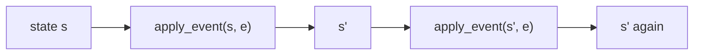

Applying the same event twice produces the same state. The applier
relies on this every time it recovers from a crash, every time
eager-push delivers an event the WAL also delivered, every time AE
ships a page that was already integrated.

If your fold isn't idempotent, the system has no recovery story.

### 2. Causal monotonicity

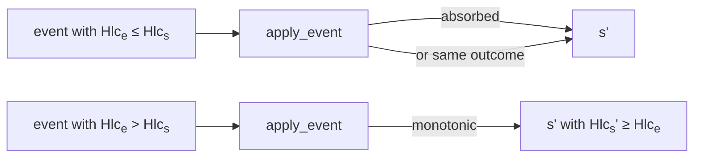

Old events are either no-ops (their effect is already in `s`) or
produce the same state. New events only increase `hlc(s)`. This is
what lets reads return `{Value, Hlc}` with confidence.

## How the applier uses a fold

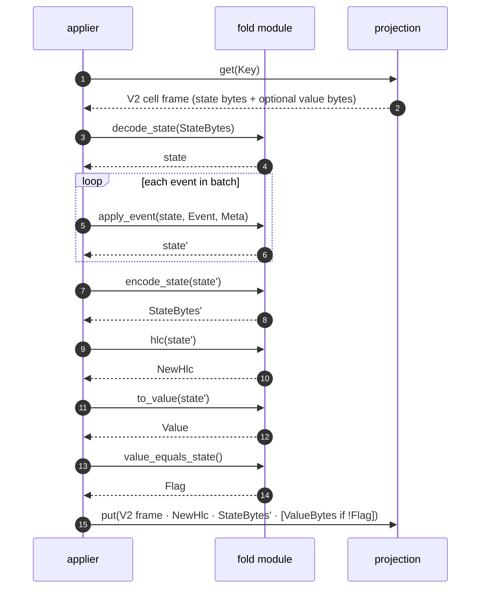

The applier owns the HLC framing; the fold owns the body bytes. This
keeps the substrate's frame format stable across folds. The optional
*value column* on the V2 frame lets the read path's HEAD-path
(`head/3`) serve the projected value without decoding the full state.
When `value_equals_state/0` is `true` the column is omitted and the
state bytes double as the value bytes.

## Reference implementations

The package ships **ten** reference folds — six general-purpose
("legacy" / record-shaped) plus four Tier 1 textbook CRDTs added
in the catalogue expansion:

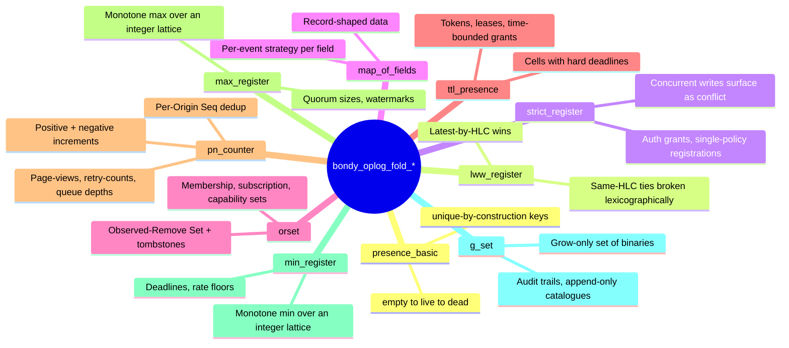

Each legacy fold is ~50–150 LOC of plain Erlang; the four new Tier
1 folds are ~80–150 LOC each. Let's look at the moods.

### Presence (unique keys)

For keys that are unique by construction — e.g., a registry where the
key is `{Realm, Policy, URI, SessionId, RegistrationId}` — no two
writers ever target the same cell. The fold becomes a three-state
machine:

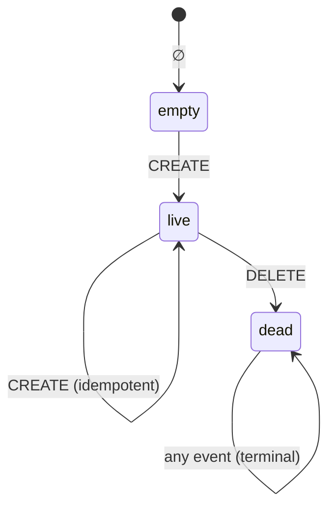

No conflict path. Total. Deterministic.

### LWW register

For configuration fields where "the latest writer wins" is good
enough:

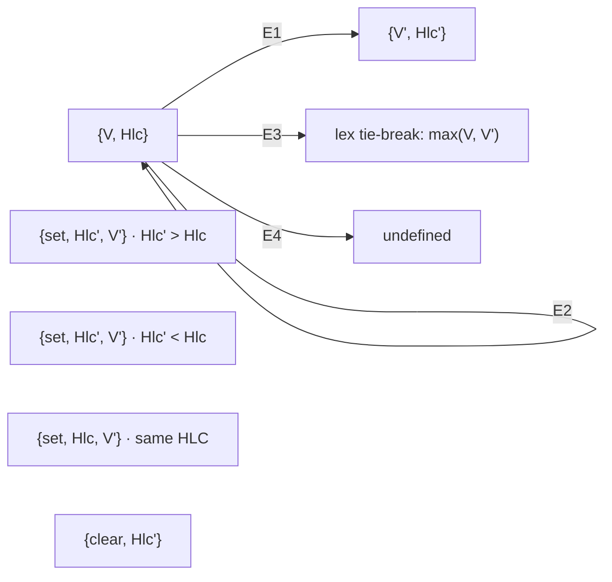

Same-HLC concurrent writes are resolved by a deterministic
lexicographic tie-break on the payload (`bondy_oplog_fold_lww_register:apply_event/2`),
not by silent loss. Convergence to the chosen value is immediate per
fold call, eventual across replicas as AE catches up.

### Strict register (conflict on concurrent)

LWW resolves same-HLC ties via lex; strict register surfaces them as
a conflict. The actual check
(`bondy_oplog_fold_strict_register:apply_event/2`) is:

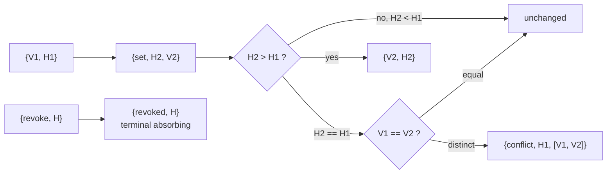

The conflict signal fires on **same HLC, distinct value** (a genuine
concurrent write to the same cell), not on a causal-successor pair.
Used for namespaces where concurrent writes are an invariant
violation — authorisation grants, single-policy registrations. The
`{revoked, _}` state is terminal: subsequent events are absorbed
without effect.

### Map of fields

Each field of a record carries its own per-event strategy. The
strategy is **per-event**, not per-field-config — events arrive
with `{Field, Strategy, Payload, Hlc}` and the fold dispatches on
`Strategy`:

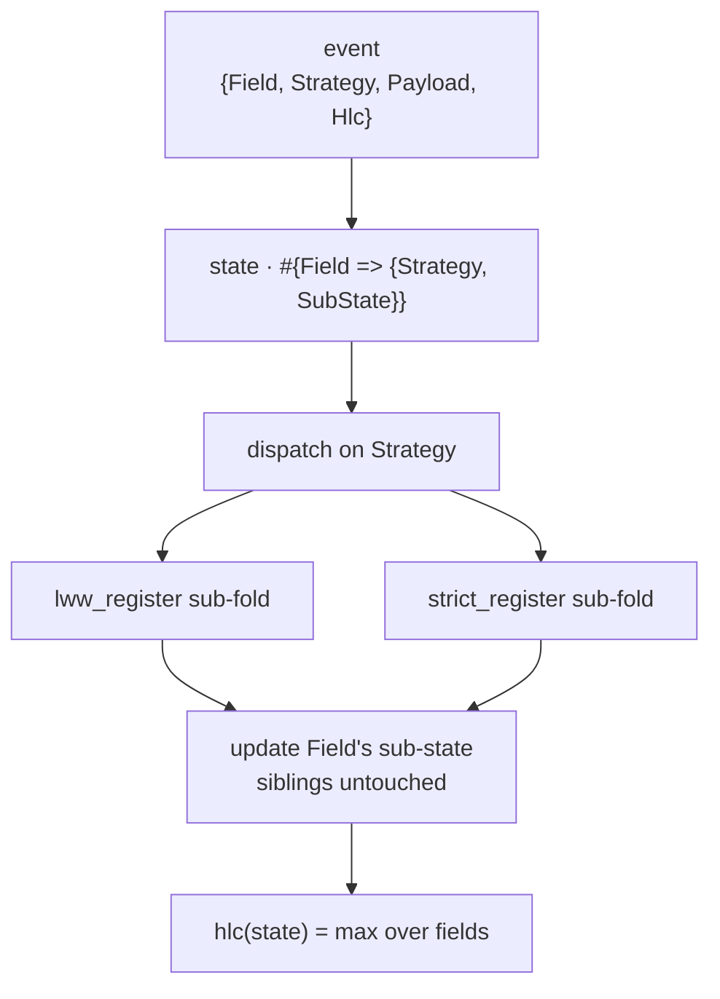

A field-level update only touches its field; sibling fields are
untouched. Cell-level HLC is the max across fields. The strategy
choice is in the **producer**, not in a static schema —
`bondy_oplog_fold_map_of_fields` deliberately diverges from the
paper-design here.

### OR-Set (observed-remove)

The classical CRDT for "concurrent add and remove must converge",
extended with **tombstones** so out-of-order delivery converges too:

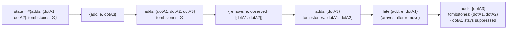

The remove kills the dots it has *observed*; concurrent adds with
fresh dots survive. The tombstone set ensures a remove that arrives
**before** its add still wins — a deliberate extension over the
paper-design's pure observed-remove.

### TTL presence

For tokens and leases with a hard deadline:

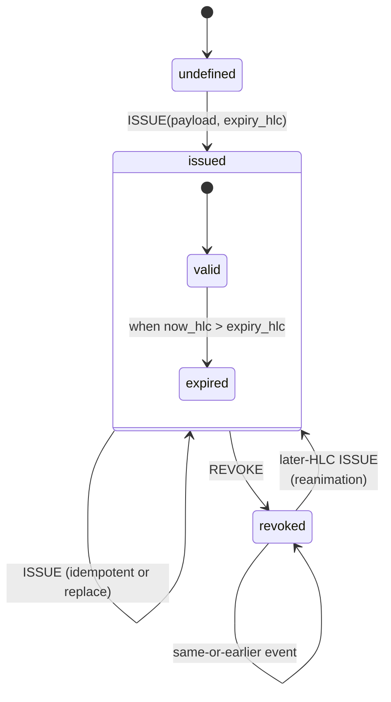

`is_currently_valid/2` lets consumers check freshness without
re-reading the event log. GC drops historic events past
`gc_threshold/1`. Note: `revoked` is **not** an absorbing terminal —
a later-HLC `ISSUE` re-animates the cell (deliberate deviation from
the paper-design, useful for re-issuing rotated tokens).

### PN-Counter

A textbook positive-negative counter: per-Origin pos/neg
accumulators that converge under per-Origin Seq monotonicity. The
fold's events are `{inc, Delta}` where `Delta` can be positive or
negative; the WAL event key (`Meta`) carries the Origin and Seq used
for dedup.

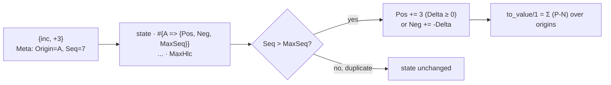

Two properties make this PN-Counter unusual:

1. **Per-Origin Seq dedup is *native*.** Duplicate `{inc, Delta}`
   events from the same Origin with `Seq ≤ MaxSeq` are absorbed as
   no-ops without consulting the value. This means a redelivered
   event from the WAL is automatically idempotent — no extra
   tombstoning, no client-side dedup, no late-arrival risk.
2. **Delta consistency is provable.** PN-Counter is one of the folds
   that returns a *true* arithmetic delta from `apply_event/3` (the
   inc amount on a non-duplicate, `none` on a duplicate). The
   200-numtest PropEr property `prop_delta_consistency` pins
   `apply_value_delta(to_value(Old), Delta) == to_value(New)` for
   every non-`none` delta. Other folds (LWW, Max, Min, presence,
   ttl_presence, strict_register, map_of_fields, orset) emit
   "replacement-shaped" deltas — the new value itself, combined via
   `apply_value_delta(_, V) -> V`.

`merge_states/2` is element-wise per Origin (max-pos, max-neg,
max-Seq) over the contiguous-prefix invariant, which means the
merge is associative-commutative-idempotent without dot vectors or
version vectors.

Use it for counters of *events* (page views, retry counts, queue
depths). The convenience wrapper is `bondy_db:counter_inc/4` —
`counter_inc(Table, Realm, Key, Delta)` translates into
`apply(Table, Realm, Key, {inc, Delta})`.

### Max-Register

A single integer with `erlang:max/2` as the lattice join:

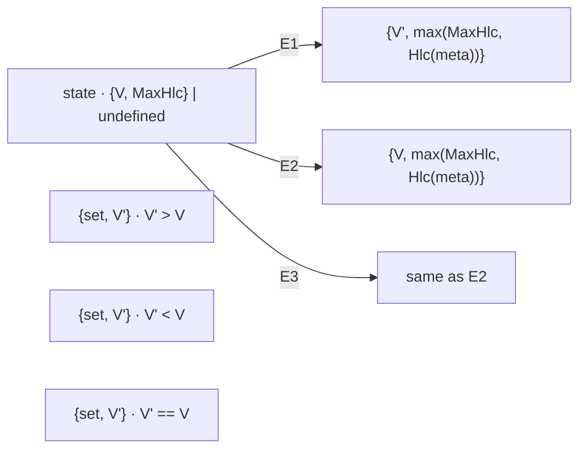

There is no `clear` event — once the lattice rises, it cannot fall.
The HLC is bumped on every applied event regardless of whether the
value moves, so `hlc/1` continues to advance monotonically. Use it
where the "max so far" is the answer: quorum sizes observed,
high-water marks, monotone counters that never decrement.

### Min-Register

Mirror of Max-Register with `erlang:min/2` instead. State,
encoding, and HLC semantics are identical; only the lattice join
flips. Useful for deadlines (`min(expiry)` across writers),
sustained-rate floors (`min(rate)` over an aggregation window),
and other monotone-downward signals.

### G-Set

Grow-only set of opaque binaries. State is the ordset plus a
`MaxHlc` (the substrate's `hlc/1` contract needs an answer):

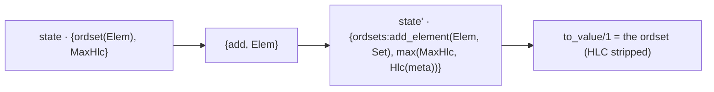

`ordsets:add_element/2` is commutative-associative-idempotent by
construction, so concurrent adds converge trivially. There is no
remove event; if your data needs observed-remove semantics use
`orset` instead.

G-Set is the only Tier 1 fold that sets `value_equals_state/0 ->
true`. That tells the substrate "skip the separate value column
on the cell frame; reuse the state bytes." The slow-path read still
calls `decode_state → to_value` to strip the HLC from the binary;
the cost is dominated by the binary parse, so the HEAD-path remains
the right place to optimise.

The deliberate deviation from the paper-design — tracking HLC
inside state rather than the state-is-ordset purity — is documented
in [the catalogue expansion
plan](../../_design/catalogue_expansion_plan.md) §4.4 and the fold
module's own docstring.

## The HLC contract

Every fold answers one question consistently:

> What is the maximum HLC ever folded into this state?

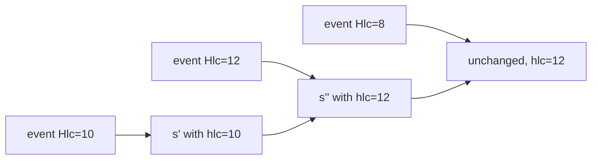

The substrate stores this HLC in the cell value frame, and reads
return it. Multi-cell reads return per-cell HLCs; the application can
compute skew.

## Choosing a fold for a namespace

```mermaid
flowchart TB
    Q1{keys unique<br/>by construction?}
    QC{counting events?<br/>(integers that add)}
    QM{monotone max/min<br/>over an integer?}
    QG{grow-only set?}
    Q2{record with<br/>independent fields?}
    Q3{concurrent writes<br/>are an invariant<br/>violation?}
    Q4{observed-remove<br/>set semantics?}
    Q5{hard deadline?}

    Q1 -->|yes| PRES[presence_basic]
    Q1 -->|no| QC
    QC -->|yes| PNC[pn_counter]
    QC -->|no| QM
    QM -->|max| MAXR[max_register]
    QM -->|min| MINR[min_register]
    QM -->|no| QG
    QG -->|yes| GSET[g_set]
    QG -->|no| Q2
    Q2 -->|yes| MOF[map_of_fields]
    Q2 -->|no| Q3
    Q3 -->|yes| STRICT[strict_register]
    Q3 -->|no| Q4
    Q4 -->|yes| ORSET[orset]
    Q4 -->|no| Q5
    Q5 -->|yes| TTL[ttl_presence]
    Q5 -->|no| LWW[lww_register]
```

The library ships these ten; consumers add their own when needed.
Bondy's `bondy_oplog_fold_presence_basic` is the registry fold;
the auth namespaces use `strict_register` and `map_of_fields`; the
Tier 1 folds are domain-neutral building blocks waiting for
consumers (see [chapter 07 §4.11](07_app_developers_tour.md) for
the counter use case).

## Testing a custom fold

A fold should come with PropEr properties:

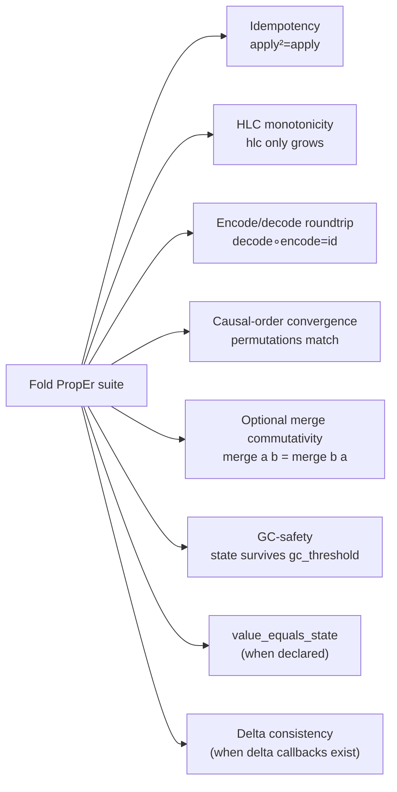

The substrate ships generic PropEr helpers — see the
`bondy_oplog_fold_*_proper_test.erl` modules. Each Tier 1 fold has
its own template covering the six core properties plus the
opt-in extensions (`prop_value_equals_state` for G-Set;
`prop_delta_consistency` for PN-Counter) at 200 numtests apiece.

## Things to keep in mind

- **The substrate doesn't know what merge means.** Every namespace
  declares its fold.
- **Idempotency is the contract.** Without it, recovery and AE
  break.
- **HLC is the time the substrate speaks.** The fold owns its
  representation but must answer `hlc/1` consistently.
- **Concurrent writes are *visible*, not hidden.** LWW makes one
  win; strict registers surface a conflict. Either way the
  decision is in the fold module, not magic.

## Pointers

Implementation:

- `bondy_oplog_fold.erl` — the behaviour (callback list,
  `validate/1`, `initial_value/1`, `apply_event/4`, `to_value/2`,
  and optional-callback dispatch helpers (`value_equals_state/1`,
  `apply_value_delta/3`)). `apply_event/4` returns
  `{NewState | {conflict, [State]}, ValueDelta | none}`.
- Six legacy folds — `bondy_oplog_fold_presence_basic.erl`,
  `bondy_oplog_fold_lww_register.erl`,
  `bondy_oplog_fold_strict_register.erl`,
  `bondy_oplog_fold_map_of_fields.erl`,
  `bondy_oplog_fold_orset.erl`,
  `bondy_oplog_fold_ttl_presence.erl`.
- Four Tier 1 folds —
  `bondy_oplog_fold_pn_counter.erl`,
  `bondy_oplog_fold_max_register.erl`,
  `bondy_oplog_fold_min_register.erl`,
  `bondy_oplog_fold_g_set.erl`.
  Each module docstring calls out where it intentionally diverges
  from the paper-design.
- `bondy_oplog_cell_frame.erl` — the V2 cell frame
  `<<2:8, HasValueColumn:1, _:7, HlcLen:16, HlcBin, StateLen:32,
  StateBytes, [ValueLen:32, ValueBytes]>>` the applier wraps every
  projection cell in.
- `bondy_oplog_applier.erl:apply_one_cell/10` — the per-cell call
  path: `decode_state → apply_event/3 → hlc → to_value →
  encode_state → put_batch`.

Related but separate:

- **`bondy_oplog_crdt.erl`** — compaction-time COG interpreter
  (`interpret_cog/2`); see [chapter 06](06_compaction_and_bootstrap.md).
- **`bondy_oplog_merge_strategy.erl`** + `bondy_oplog_merge_strict_uniqueness.erl`
  — one-callback `merge/3` behaviour for MST same-key duplicate
  resolution. Unrelated to per-event folding.
