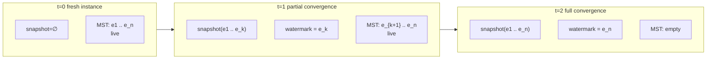
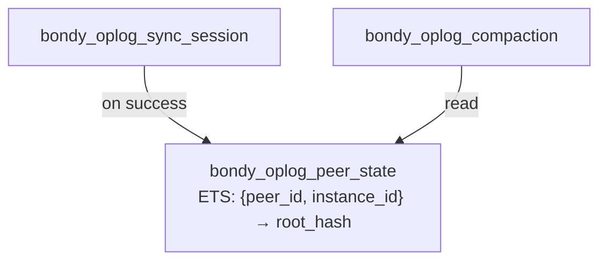
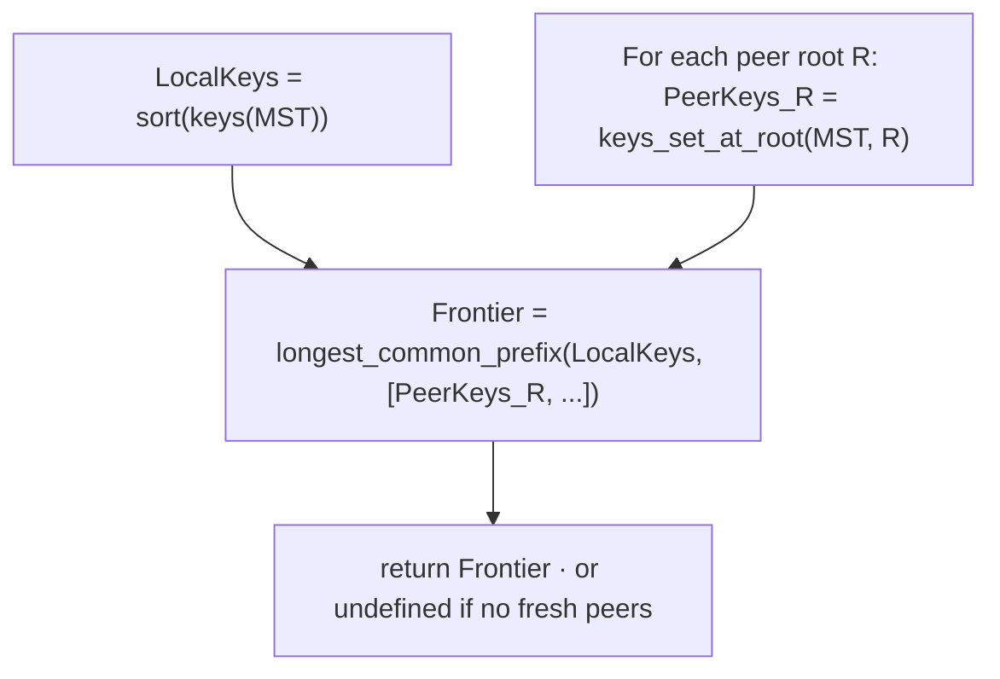
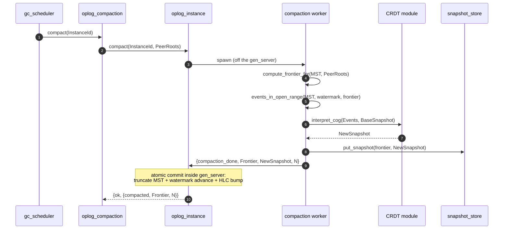
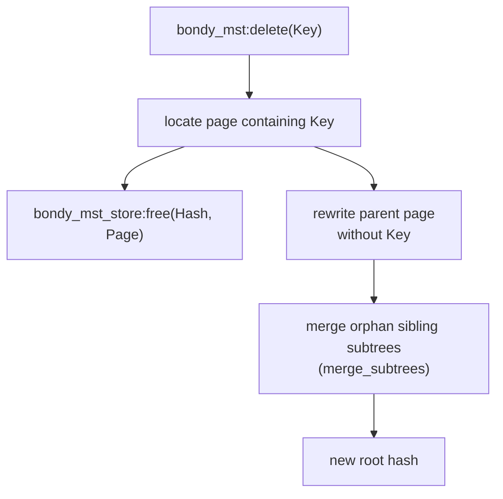
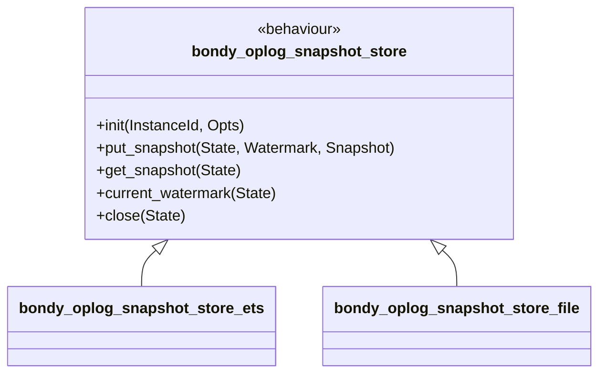
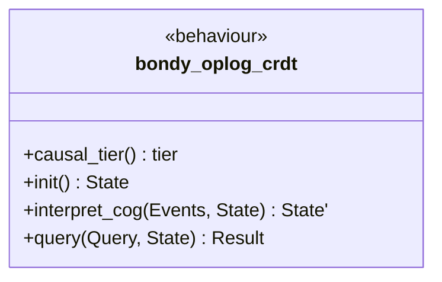
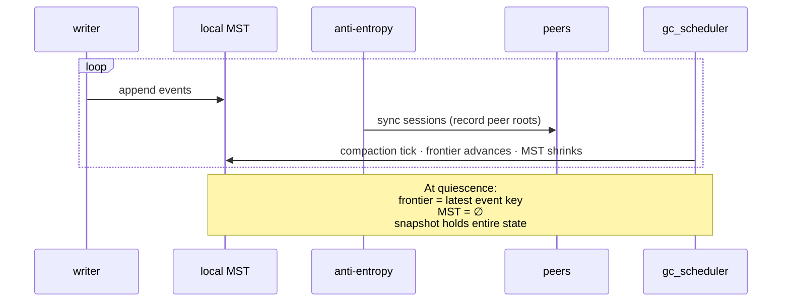
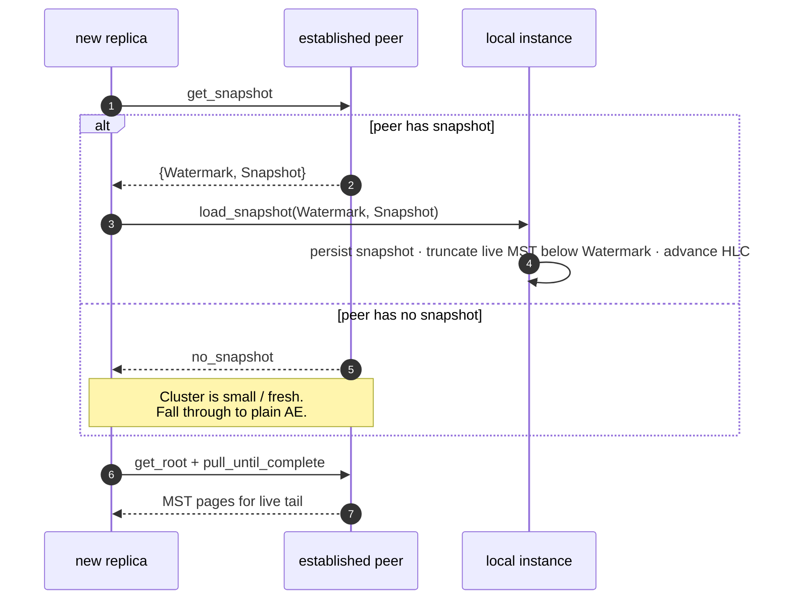
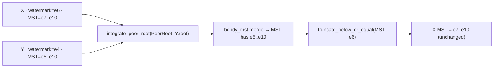

# Causal stability, compaction & bootstrap

> Audience: anyone who wants to know **why the log is bounded**, why a
> long-running cluster eventually carries no live events at all, and
> how a brand-new replica gets up to speed.
> Time to read: ~20 min.

This chapter covers the property that distinguishes `bondy_oplog` from
a plain replicated log: **the oplog is self-truncating**. Once peers
have caught up, the events that they all hold can be removed from the
MST — not marked deleted, *physically* removed — and replaced with a
single compacted state snapshot. At full convergence the live MST is
**empty**; the cluster's persistent state is the snapshot alone.

The mechanism in this codebase is the COG (Concurrent Operation
Group) idea — `bondy_oplog_compaction` orchestrates;
`bondy_oplog_instance` runs the cycle; `bondy_oplog_gc_scheduler`
fires it on a timer; `bondy_mst:delete/2` does the physical
deletion; `bondy_oplog_sync_session:bootstrap/3` carries the
snapshot to new replicas.

## The intuition: the MST is not a log, it's a *window*

Everywhere else in the architecture documentation we talk about
"events in the MST". That is true, but it understates the lifecycle.
Pictured over time, an instance looks like this:



The MST is the **live window** of unstable events. The snapshot is the
**closed past**. The watermark separates the two. As peers exchange
events and confirm they have them, the boundary advances.

A handful of consequences fall out of this:

1. **The oplog is bounded by network propagation, not by app
   lifetime.** A long-quiet cluster's MST shrinks to nothing.
2. **A new replica syncs the snapshot once, then catches up the
   small live tail.** Not the whole history.
3. **The MST root hash changes when truncation happens** — and that
   is fine, because every replica that has seen the same set of
   peers truncates to the same watermark and arrives at the same
   tree.

## What does "stable" mean here?

An event is **stable** when every (fresh, non-stale) peer is known to
hold it. The library tracks this through per-peer root hashes,
recorded by sync sessions:



`bondy_oplog_peer_state` records, per `(peer, instance)`, the most
recent root hash observed on a successful sync, plus a `last_seen`
timestamp. Peers we haven't heard from in `peer_timeout_ms` (default
30s) are filtered out — silent peers must not pin the watermark
forever.

## Computing the stability frontier

The frontier is the highest event key K such that **every fresh peer
has every key ≤ K**. The algorithm — `compute_frontier_for/2` in
`bondy_oplog_instance.erl` — is:



A few subtle things:

- **`keys_set_at_root(MST, R)`** walks the *local* MST as if its root
  were R, recovering the set of keys present at that historical
  state. Page content-addressing makes this cheap — the historical
  root's pages are still present if they have not been GC'd.
- **The frontier is the longest common *prefix*** because keys are
  HLC-ordered. Stability is monotonic in HLC: if a peer has key K,
  it transitively has every key < K.
- **No coordination is required.** Two replicas that have observed
  the same set of peers compute the same frontier independently.

## The compaction cycle

`bondy_oplog_gc_scheduler` ticks every `gc_interval_ms` (default 1s)
and spawns one short-lived worker per instance. The worker runs the
five-step cycle:



Two design choices worth noting:

- **The heavy work is off the gen_server.** Frontier computation,
  event extraction, `interpret_cog`, and snapshot persistence happen
  in a monitored worker. The gen_server only executes the atomic
  commit (truncate + watermark + HLC bump). Local appends and reads
  proceed throughout.
- **The cycle is concurrency-guarded.** Only one compaction per
  instance is in flight at a time; overlapping requests reply
  `{ok, no_change}` and the next tick retries. Compaction is
  idempotent, so a missed tick is not a problem.

The cycle yields `{ok, no_change}` (no fresh peers, empty
intersection, or frontier ≤ current watermark) far more often than
`{ok, {compacted, _, _}}`. That is expected — most ticks are no-ops
that just confirm there is nothing new to compact.

## "Truncate" means **delete pages**, not tombstone events

The MST truncation step is the load-bearing one. It is not a
soft-delete: `bondy_oplog_instance:truncate_below_or_equal/2` calls
`bondy_mst:delete/2` for each event key ≤ the watermark, and
`bondy_mst:delete/2` performs **structural page-level deletion**.



The page that held the key is **freed** (added to the page store's
free set / tombstones file), the parent page is rewritten without the
entry, and the orphaned sibling subtree on the right is merged into
the previous entry's subtree on the left. The result is a smaller
tree, with a new root hash.

This matters because:

- **No tombstones to ship over AE.** Sync sessions exchange only
  pages that exist; truncated keys are simply gone.
- **GC reclaims the disk.** The pack-store rewrite GC reads only
  pages reachable from the live root; freed pages are not written
  to the new pack and the old packs are unlinked.
- **Truncation is deterministic.** Every replica that truncates the
  same prefix arrives at the same tree (same pages, same root hash).

`bondy_mst:delete/2` is implemented in `bondy_mst.erl` at
`delete_below_level/5` / `delete_from_level/4` / `merge_subtrees/3`.

## The snapshot

A snapshot is the output of `CrdtMod:interpret_cog(Events, BaseState)`
folded over every event in the stable prefix since the last
compaction. The substrate stores it via the
`bondy_oplog_snapshot_store` behaviour:



Two storage implementations ship:

| Backend | Durability | Use |
|---|---|---|
| `bondy_oplog_snapshot_store_ets` | in-memory | tests, ephemeral instances |
| `bondy_oplog_snapshot_store_file` | atomic rename, fsync | production |

The library policy is **one snapshot per instance** — the most recent
one. Older snapshots are not retained. The live MST plus the latest
snapshot fully reconstruct the application state.

## The CRDT module (the COG interpreter)

The substrate is meaning-agnostic. Each instance is bound at start
time to a CRDT module implementing the `bondy_oplog_crdt` behaviour:



Three things to know about `interpret_cog/2`:

1. **It must be deterministic.** Same `(Events, State)` ⇒ same
   `State'`, on every replica. Non-determinism breaks Strong
   Eventual Consistency.
2. **It receives events in key (HLC) order.** Concurrent operations
   are co-batched; the interpreter resolves conflicts however its
   CRDT semantics require.
3. **It is called both for compaction and for live queries.** During
   compaction it folds the stable prefix into the snapshot; during
   reads `bondy_db` may also fold live events on top of the latest
   snapshot.

`interpret_cog` is the **COG interpreter** of the original Canteen
design — same role, same contract, same determinism invariant.

## The empty-MST steady state

Imagine three peers, a moderate write rate, and steady AE. Over time:



In a quiescent, fully-converged cluster the live MST is empty. New
appends populate it briefly; the next compaction tick (~1s) drains it
again. The cluster's *durable* persistent state is the snapshot —
the MST is a transient buffer for "events the cluster has not yet
all agreed on".

This is the precise opposite of the conventional log-replication
mental model. Practically, it means:

- **Old replicas don't carry old log.** Their disk footprint is
  bounded by snapshot size, not write history.
- **AE bandwidth is bounded.** Catching up is at worst the size of
  the live tail, never the size of history.
- **New replicas don't replay the world.** They get the snapshot
  and a small live tail (next section).

## Bootstrap: how a new peer joins

The complement to truncation is **snapshot transfer**. A replica
joining a cluster — or recovering from a long outage — has a stale
or empty MST. Plain anti-entropy would have to ship the entire
history; instead, the replica bootstraps from a peer:



The entrypoint is `bondy_oplog_sync_session:bootstrap/3`. After the
snapshot is installed, normal AE picks up at the watermark and
catches the live tail (typically a few seconds of events) — not the
whole history.

`bondy_oplog_instance:load_snapshot/3` enforces watermark monotonicity:

- If the local watermark is `undefined`, install the snapshot.
- If the peer's watermark is strictly greater, install and advance.
- Otherwise refuse with `{error, watermark_not_advancing}` and fall
  through to plain AE.

## The independent-watermark reconciliation rule

Two replicas may compact at different rates. Say Replica X has
truncated up to `e6` while Replica Y has only truncated up to `e4`.
When AE pulls Y's pages into X, X must not "un-truncate" by accepting
events it already folded into its snapshot. The mechanism is in
`bondy_oplog_instance.erl:do_handle_call({integrate_peer_root, _})`:

```erlang
%% bondy_oplog_instance.erl  ~line 1724
MST1 = bondy_mst:merge(MST0, MST0, PeerRoot),
MST2 = case State#state.watermark of
           undefined -> MST1;
           W         -> truncate_below_or_equal(MST1, W)
       end,
```

The peer's pages are merged in, then `truncate_below_or_equal/2`
re-runs against the local watermark, dropping any keys X has already
compacted away. The local-append side uses the same idea via
`below_or_equal_watermark/2` (line 2350) — appended or peer-supplied
events whose key is ≤ the local watermark are rejected at the door.



Two replicas with different watermarks are **not divergent** — they
agree on application state. One is just slightly more compact. On Y's
next GC tick, Y reads X's advanced root via `bondy_oplog_peer_state`
and computes a new frontier that absorbs `e5..e6` into its own
snapshot.

## What can go wrong (and what catches it)

| Hazard | Catch |
|---|---|
| Silent peer pins the watermark forever. | `peer_timeout_ms` filters stale peer entries (default 30s); the frontier ignores them. |
| Replica truncates a prefix the application still cares about. | `interpret_cog` must consume the prefix into the snapshot first. The compaction cycle is `frontier → events → interpret_cog → snapshot → truncate` — the snapshot is durable *before* the MST mutation. |
| Two compactions race. | One-at-a-time guard in `bondy_oplog_instance`: a second `compact` request while one is in flight replies `{ok, no_change}`. |
| Peer ships events the local replica has already truncated. | Integrate path drops events with `key ≤ watermark`. |
| Bootstrap snapshot is older than local. | `load_snapshot/3` refuses with `watermark_not_advancing` and falls through to plain AE. |
| `interpret_cog/2` is non-deterministic. | Convergence breaks silently. The behaviour documentation flags this as the invariant; PropEr suites for each CRDT verify it (`bondy_mst_crdt_SUITE.erl`). |

## Tests that pin this down

The COG truncation pipeline is the most-tested part of the substrate
because everything else relies on it. The relevant suites:

- `test/bondy_oplog_compaction_test.erl` — frontier computation,
  watermark advance, idempotency, no-change cases, MST shrinkage.
- `test/bondy_oplog_gc_scheduler_test.erl` — tick cadence, semaphore
  cap, set_interval/set_trigger races, per-instance isolation.
- `test/bondy_oplog_bootstrap_test.erl` — snapshot transfer,
  watermark monotonicity, no-snapshot fallback, post-bootstrap AE.
- `test/bondy_mst_crdt_SUITE.erl` — end-to-end determinism + Strong
  Eventual Consistency for the test CRDT (`bondy_mst_test_crdt_server`).

## Things to keep in mind

- **The MST is a *window*, not a log.** Bounded by network
  propagation, not by app lifetime.
- **Truncation is real deletion.** Pages are freed; the next
  pack-store GC reclaims the disk.
- **Convergence implies emptiness.** At full quiescence, the live
  MST is `∅`; the snapshot holds the entire state.
- **The CRDT module is the only meaning.** The substrate truncates;
  `interpret_cog/2` decides what the truncated prefix folds into.
- **New replicas don't replay the world.** Snapshot bootstrap +
  small live tail catch-up.

## Pointers

Implementation:

- `bondy_oplog_compaction.erl` — orchestrator (reads peer roots,
  delegates to instance).
- `bondy_oplog_gc_scheduler.erl` — periodic tick, semaphore cap,
  per-instance worker.
- `bondy_oplog_instance.erl`:
    - `compute_frontier_for/2` — frontier as longest common prefix.
    - `do_compact_async/3` + `run_compaction_worker/8` — off-gen_server
      heavy lifting.
    - `commit_compaction/2` — atomic truncate + watermark + HLC bump.
    - `truncate_below_or_equal/2` — drops keys ≤ watermark.
    - `do_load_snapshot/3` + `apply_loaded_snapshot/3` — bootstrap
      install with monotonicity guard.
    - `do_handle_call({integrate_peer_root, _}, _, _)` — merge +
      re-truncate on AE integration.
    - `below_or_equal_watermark/2` — append-side filter.
- `bondy_oplog_peer_state.erl` — per-(peer, instance) root cache;
  `get_instance_peer_states/1` filters by `peer_timeout_ms` (default
  30 000 ms).
- `bondy_oplog_snapshot_store.erl` + `_ets.erl` + `_file.erl` —
  one-snapshot-per-instance behaviour and implementations.
- `bondy_oplog_sync_session.erl:bootstrap/3` — fetch peer snapshot
  then pull live tail; falls back to plain AE on `no_snapshot`.
- `bondy_oplog_crdt.erl` — `interpret_cog/2` callback.
- `bondy_mst.erl:delete/2`, `delete_below_level/5`,
  `delete_from_level/4`, `merge_subtrees/3` — physical page deletion
  with sibling-subtree merge.

Tests:

- `test/bondy_oplog_compaction_test.erl`
- `test/bondy_oplog_gc_scheduler_test.erl`
- `test/bondy_oplog_bootstrap_test.erl`
- `test/bondy_mst_crdt_SUITE.erl` (+ `bondy_mst_test_crdt_server.erl`)

Background / origin:

- Preston McCrary, *Canteen* — UC Berkeley EECS-2022-160 (source of
  the COG / interpret_cog vocabulary). The local code does not depend
  on the paper.
